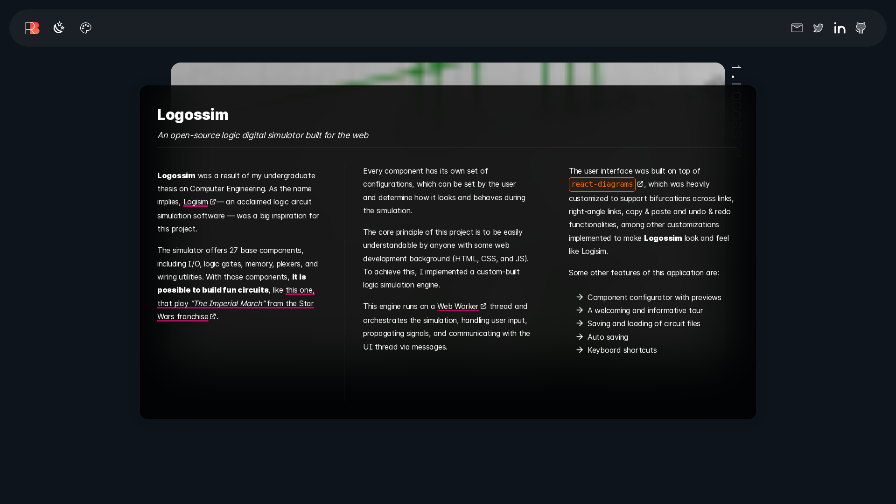
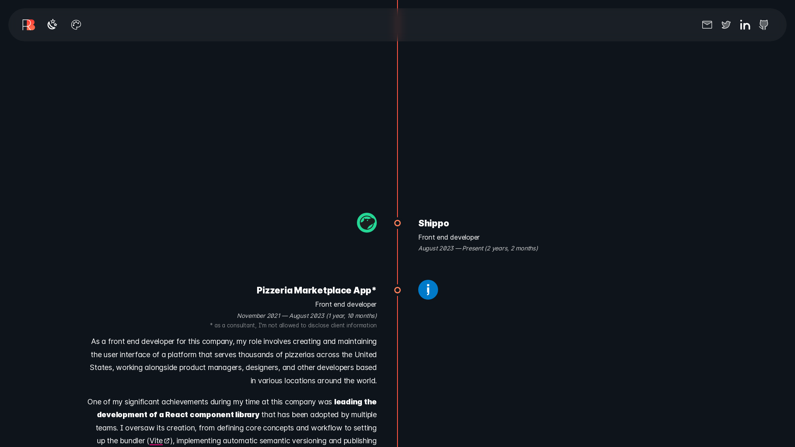
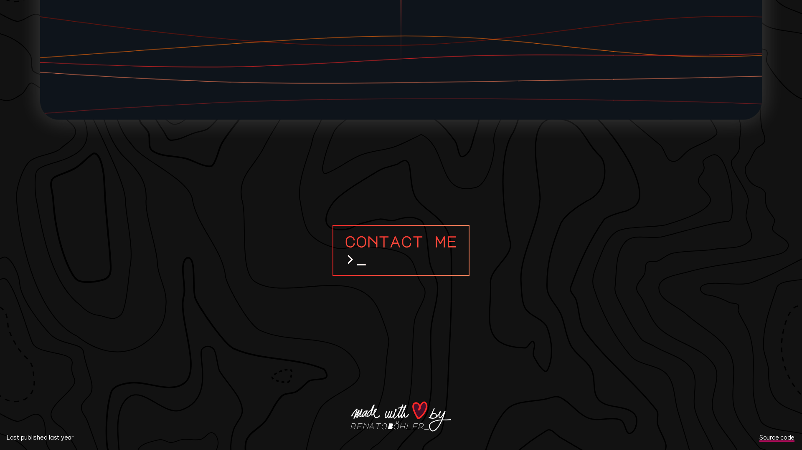

  

# My personal website

Hey there! Thanks for visiting the source code of my personal website 😄

You can take a look at it yourself by visiting [bohler.dev](https://bohler.dev)

## Screenshots

Here are some dynamically generated screenshots of the page:

